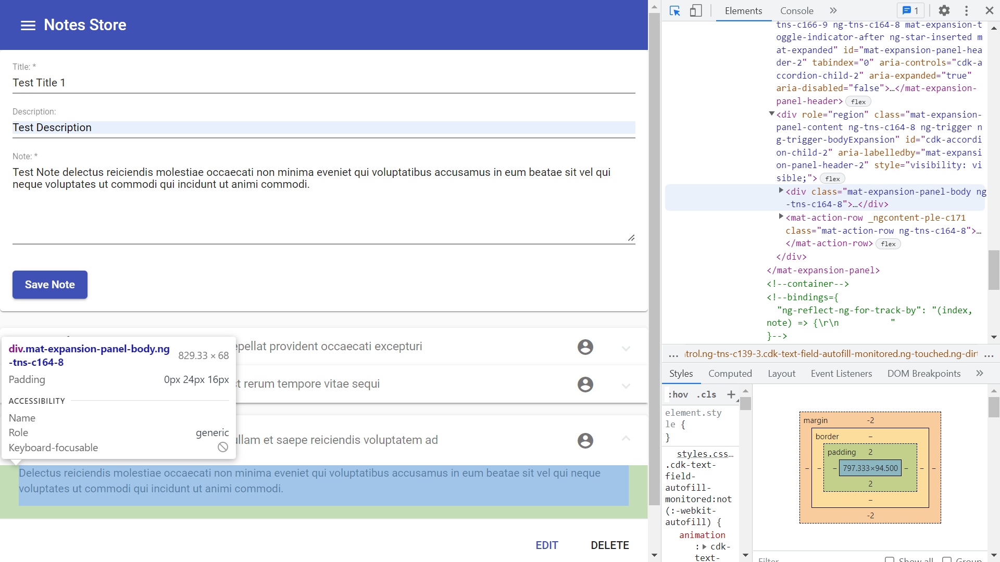

# :zap: Angular Material Notepad

* Angular used with Material & Tailwind components to display and add notes in a table
* **Note:** to open web links in a new window use: _ctrl+click on link_


## :page_facing_up: Table of contents

* [:zap: Angular Material Notepad](#zap-angular-material-notepad)
  * [:page\_facing\_up: Table of contents](#page_facing_up-table-of-contents)
  * [:books: General info](#books-general-info)
  * [:signal\_strength: Technologies](#signal_strength-technologies)
  * [:camera: Screenshots](#camera-screenshots)
  * [:floppy\_disk: Setup](#floppy_disk-setup)
  * [:computer: Code Examples](#computer-code-examples)
  * [:cool: Features](#cool-features)
  * [:clipboard: Status \& To-Do List](#clipboard-status--to-do-list)
  * [:clap: Inspiration](#clap-inspiration)
  * [:file\_folder: License](#file_folder-license)
  * [:envelope: Contact](#envelope-contact)

## :books: General info

* Simple Angular Material form with error-checking.
* Created notes are added to a Mat-Expansion Panel.
* Refreshing display loses added data
* Notes can be deleted (the edit button has no function linked to it so it does nothing)

## :signal_strength: Technologies

* [Angular framework v16](https://angular.io/)
* [Angular Material v16](https://material.angular.io/)
* [Angular Material Icons](https://material.io/resources/icons/?style=baseline)

## :camera: Screenshots



## :floppy_disk: Setup

* `npm i` to install dependencies
* `ng serve` for a dev server. Navigate to `http://localhost:4200/`. The app will automatically reload if you change any of the source files

## :computer: Code Examples

* `notes-service.ts` function to add note to existing notes array. Uses `??` nullish coalescing operator to create an id basd on the array length or use a fallback id of 1 (array empty)

```typescript
  addNote(title: string, description: string, body: string) {
    const lastId: number = this.notes[this.notes.length - 1]?.id ?? 1;
    const note: Note = {
      id: lastId,
      title: title,
      description: description,
      body: body,
    };
    this.notes.push(note);
    this.notesUpdated.next([...this.notes]);
  }
```

## :cool: Features

* Material components, use of nullish coalescing operator

## :clipboard: Status & To-Do List

* Status: Working
* To-Do: Add data store - database? navbar links.

## :clap: Inspiration

* [Angular Wiki: Double Question Marks(??) or Nullish coalescing Operator in Angular/Typescript](https://www.angularjswiki.com/angular/double-question-marks-or-nullish-coalescing-operator-in-angular-typescript/)

## :file_folder: License

* This project is licensed under the terms of the MIT license.

## :envelope: Contact

* Repo created by [ABateman](https://github.com/AndrewJBateman), email: `gomezbateman@yahoo.com`
